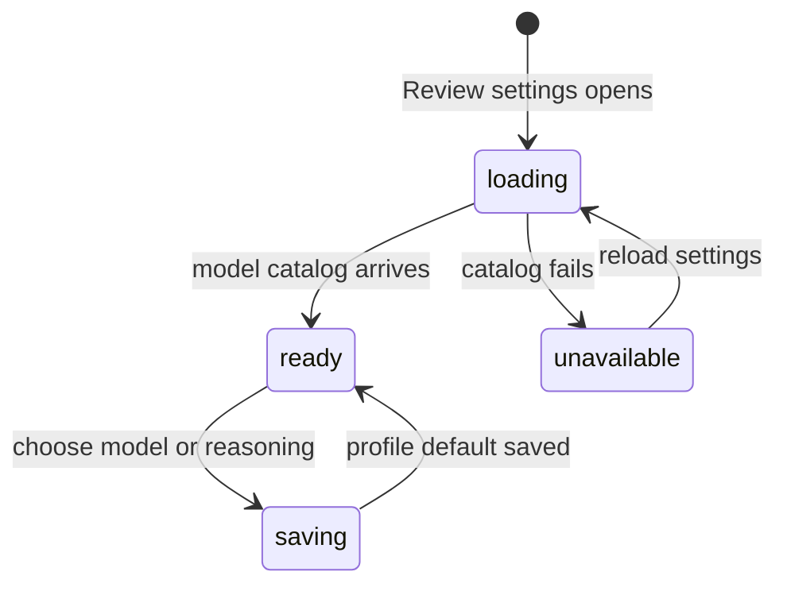

# Review defaults

## Summary

Review preferences are profile-scoped defaults in Settings > Review for the next Analysis run. The section chooses an API-key model and reasoning level; it does not start an Insight, configure GitHub, or replace the per-Insight provider choices in an active run dialog. The active profile supplies the preference scope.

## The simple case

The maintainer opens Settings > Review. Patchdesk reads the available API-key model catalog, selects the saved Analysis model when it is still available, and otherwise chooses the first available model. The maintainer chooses a reasoning level from Minimal, Low, Medium, High, or Extra high. The choice is saved for that profile and seeds the next Analysis dialog.

The section also reports whether the Codex CLI account is available, but it does not edit a Codex preference. Provider, model, and reasoning can still be chosen separately in an Analysis, Brief, or Walkthrough run dialog.

## The task, event by event

### Arrive

The Review section labels the controls Default model and Default reasoning. It loads the provider catalog and lists only API-key models in the Settings model selector. The saved Analysis preference is profile-scoped and defaults to the API key provider with the ordinary fallback model and Medium reasoning until the catalog supplies a usable choice.

The section separately checks whether the Codex CLI account provider is available. If no eligible model can be shown, it explains that provider credentials or local configuration must be made available and that the saved preference is kept.

### Leave unchanged

Opening Review settings, reading the provider status, or switching Settings sections does not start an Insight. It does not change the active Review, saved Brief, Analysis, or Walkthrough. Closing Settings without selecting a new model or reasoning value has no effect.

### Begin an action

Choosing an API-key model or reasoning level updates the visible default and saves the complete Analysis preference for the active profile. The selected reasoning value can be Minimal, Low, Medium, High, or Extra high.

Changing profiles reloads the new profile's preference and provider catalog. A preference is not copied between profiles. The run dialog later saves the provider, model, and reasoning used for its own Insight type when a run starts.

### While the action runs

The provider catalog loads independently from the local preference already shown. While the catalog is unavailable, the model selector is disabled and the saved value is kept. A stale saved model is replaced by an available API-key model when the catalog succeeds.

Settings does not activate Codex merely by opening this section. If the stored Analysis preference names Codex, Settings displays an API-key fallback without overwriting the stored Codex choice. An explicit model or reasoning change in Settings writes an API-key Analysis preference.

### Settle

A successful choice remains visible and seeds the next Analysis run for this profile. The Settings section does not retain a running state because it never starts work. A failed local save is not exposed as a separate Settings error surface; the previous stored preference remains the safe fallback for the next load.

If the provider catalog fails, Settings shows the no-eligible-model guidance and preserves the saved preference. The maintainer can reload the section after fixing provider configuration.

## Variants

| Variant | Before the action runs | While the action runs |
| --- | --- | --- |
| Workspace profile and GitHub account | The active profile owns its Analysis default; GitHub account identity does not become a credential in the preference. | A profile change loads a separate preference and catalog for the new profile. |
| Pull request and Review state | The default seeds a future Analysis run; it does not depend on one Pull request or represented revision. | Existing Review, Brief, Analysis, and Walkthrough state is unchanged. |
| GitHub permissions and merge readiness | No GitHub write or merge readiness is required to choose defaults. | Provider catalog or preference persistence does not grant Review or merge authority. |
| Network, local tool, and Insight provider availability | Settings needs the local provider catalog for model choices; Codex availability is checked separately. | A missing or failed catalog disables model selection and keeps the saved preference. |
| Input path: mouse, keyboard, or desktop menu | Model and reasoning controls support mouse and keyboard in the Settings overlay. | The same profile-scoped save applies to either input path; desktop menus do not start a run. |

## Cancel and interrupt

| Event | Before the action runs | While the action runs |
| --- | --- | --- |
| Cancel, Stop, or Escape | Closing Settings or leaving a selector unchanged keeps the current default. | There is no Review-default Stop control; only catalog loading may still settle. |
| Navigate to another Patchdesk screen, Review, Settings section, or workspace profile | Navigation leaves the stored default unchanged. | A profile change prevents the old catalog response from populating the new profile's controls. |
| Start another action or request a refresh | A new model or reasoning choice replaces the local draft immediately. | A newer choice owns the profile preference; no Insight run is started by the save. |
| GitHub, the network, a local tool, or an Insight provider fails or times out | No GitHub access is needed to edit the controls. | Catalog failure shows unavailable guidance; Settings does not retry a provider run. |
| Close Settings, reload the renderer, close the window, or quit Patchdesk | Unchanged controls leave no pending write. | A completed save is restored on the next load; an in-flight catalog or save is not a durable run. |
| The pull request, represented revision, pending review, permission, or other target changes elsewhere | Defaults are independent of a particular target. | Target changes do not alter the profile's default preference. |
| macOS focus, a file or folder picker, or another input path takes control | Focus loss without a selection has no effect. | Focus loss does not start a run or change the selected default. |

## Interactions with other systems

**Workspace profile and identity.** The active profile scopes the Analysis default and its provider catalog context.

**Review revision and freshness.** Defaults do not represent a revision; each later Insight run binds its own chosen values to the current Review.

**Local persistence and recovery.** The preference is local profile state. A stored Codex Analysis choice is preserved even when Settings can display only its API-key fallback.

**GitHub permissions and write authority.** Choosing a model or reasoning level performs no GitHub write and does not authorize one.

**Network, local tools, and Insight providers.** API-key model discovery and Codex availability depend on configured provider state. Settings does not log in, install a provider, or run an Insight.

**Concurrent operations and locking.** Catalog generations keep a late response from an earlier profile or load from replacing newer controls.

**Feedback, errors, and diagnostics.** Unavailable catalogs show bounded guidance and keep the saved preference; provider output and credentials are not shown.

**Preferences, keyboard commands, and desktop integration.** Settings defaults seed the next Analysis run; each Insight run dialog owns its own provider/model/reasoning selection and persistence.

**Supported input and accessibility limits.** Keyboard and mouse model and reasoning controls are supported. Touch, pen, and screen-reader behavior are outside the supported product surface.

## Edge cases

- Review Settings lists API-key models even when Codex CLI account is available.
- A stored Codex Analysis preference is not overwritten merely by opening Settings.
- A stale saved model falls back to the first available API-key model.
- A catalog with no API-key model can still report Codex availability and explains how to use Codex from an Insight run dialog.
- A catalog failure disables the model selector and preserves the stored preference.
- The reasoning selector offers the full five-value Settings range even when the currently selected model's catalog advertises a narrower range for a run dialog.
- Model labels can be searched by canonical model ID in the combobox.
- Settings defaults apply only to Analysis; Brief and Walkthrough retain their own run preferences.

## Open questions and verification

- Live desktop verification is pending; no CDP pass was run for this document.
- Confirm the visible fallback when a saved API-key model disappears from the provider catalog.
- Confirm whether a failed preference write has visible feedback outside the current tests.
- Confirm the exact handoff from Settings defaults to the Analysis run dialog.
- Confirm the Codex availability wording for each external login and app-launch PATH state.

Verified against Patchdesk application source commit `3100615`.
