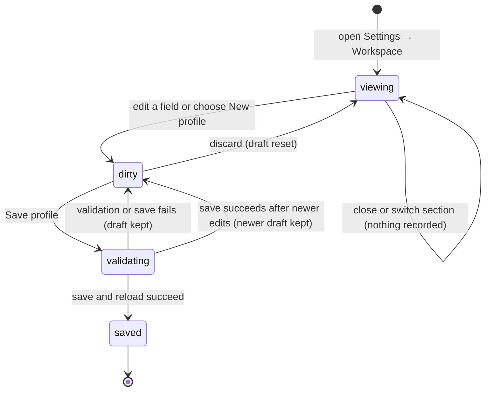

# The workspace profile editor

## Summary

The workspace profile editor creates and updates the local configuration that tells Patchdesk which GitHub identity, folders, repository owners, and instruction files belong together. The maintainer reaches it through Settings → Workspace. Existing profile IDs are fixed; choosing New profile opens a blank draft whose ID can be entered. The editor is available without an open Review, but Patchdesk cannot save a usable profile unless its values pass local and main-process validation.

## The simple case

The maintainer opens Settings, chooses Workspace, and edits the active profile's label, GitHub host, GitHub account, workspace roots, owner filters, or rule paths. The Save profile button appears after the first change.

Patchdesk trims the values when Save profile is pressed. It rejects any list that still contains a blank entry. If validation succeeds, Patchdesk saves the profile, reloads the active workspace, and removes the dirty state.

For a new profile, Patchdesk also selects the saved profile. The Pull requests screen then reloads for that profile. For an existing profile, the profile ID stays disabled and the saved watchlist is preserved even though the editor does not send the watched repositories as form fields.

## The task, event by event

### Arrive

Settings opens on the requested section, or on General when no section was requested. Choosing Workspace shows Reviewing as, Profile, and Workspace scope cards. The active profile selector and all saved values come from the latest loaded workspace state.

The Profile ID field is disabled for an existing profile. Workspace roots, owner filters, and rule paths appear as repeatable rows. Each root row also has Choose folder. Saved roots can show repository-discovery status and watched repositories beneath the row.

Reviewing as checks the GitHub CLI while the section is open. One authenticated account appears as a resolved statement. Several accounts appear in a selector. If the CLI is missing, unauthenticated, or cannot be checked, the panel explains the failure and keeps manual account fields available.

When an empty account draft first receives authenticated-account results, Patchdesk adopts the sole account, or the account that `gh` marks active when several exist. It does this once and never overwrites an account already loaded or typed by the maintainer. A configured account that is absent from the authenticated list produces a warning.

Opening the editor records nothing. Switching between Settings sections does not unmount the profile draft, so an unsaved edit remains when the maintainer returns to Workspace.

### Leave unchanged

Closing Settings without editing closes the overlay. Patchdesk returns focus to the control that opened it. No profile or active-profile selection is written.

Switching Settings sections, opening and cancelling a folder picker, or selecting the already active profile leaves the profile unchanged. A folder picker changes the draft only when macOS returns a selected folder.

### Begin an action

The first field edit makes the profile draft dirty and reveals Save profile. Adding or removing a workspace-root, owner-filter, or rule-path row is also an edit. Choosing a folder replaces the value in that root row.

New profile replaces the editor with a creation draft: blank ID, blank label, `github.com` as the host, blank GitHub account, one blank workspace-root row, one blank owner-filter row, and no rule-path rows. The Profile ID field becomes editable. Save profile remains available because the editor is in creation mode.

Save profile first clears the previous error, trims every scalar and list value, and rejects a workspace-root, owner-filter, or rule-path list that contains a blank row. A new profile is also rejected before a request if its trimmed ID matches a profile already loaded in Settings.

If local checks pass, Save profile changes to Saving profile… and becomes disabled. Patchdesk sends a create request for a new profile or an update request for an existing profile.

### While the action runs

The remaining fields stay editable while the save request is pending. Patchdesk records which draft generation began the save. Text entered after that point remains in the editor when the earlier save succeeds, and the editor stays dirty rather than replacing the newer text with the saved values.

For a new profile, Patchdesk waits for the profile save and then requests that the new profile become active. Only after both requests succeed does it reload the workspace.

The Save profile button is disabled during the request, so the same editor cannot submit a second save through that button. Closing Settings while a dirty save is pending opens the dirty-draft decision. Choosing Save there shows Saving… and disables Save, Discard changes, and Cancel until the request settles.

### Settle

When an existing profile save succeeds, Patchdesk replaces the saved baseline with the normalized values and reloads the workspace. Watched repositories remain part of the saved profile. If no newer edit exists, the Save profile button disappears.

When a new profile save and selection both succeed, Patchdesk leaves creation mode, applies the new profile, returns the main app to the Pull requests screen, and reloads that profile's listing state.

A local validation failure keeps the draft and shows a Profile update failed alert with the specific blank-list or duplicate-ID message. A request failure also keeps the draft, but the editor shows the request's error message. The maintainer can edit and try again.

If the maintainer typed a newer edit during the request, the successful request updates the saved baseline but leaves the newer draft visible and dirty. A later Save profile is required to persist that newer edit.

## Variants

| Variant | Before the action runs | While the action runs |
| --- | --- | --- |
| Workspace profile and GitHub account | Existing profiles have fixed IDs. New profiles need an ID and a GitHub account. Reviewing as can update the draft's account before save. | A new profile is selected only after its save succeeds. An existing-profile save does not change the active profile. |
| Pull request and Review state | No Review is required. Opening Settings preserves the underlying Pull requests screen or Review workbench. | A profile switch after creation clears the loaded workbench and returns the app to Pull requests after the selection succeeds. |
| GitHub permissions and merge readiness | No repository permission or merge readiness is required because profile saving is local. The configured account must still parse as a valid GitHub login. | No GitHub write occurs. Reloading the selected profile can later expose account or repository-read failures on the Pull requests screen. |
| Network, local tool, and Insight provider availability | Network and Insight providers do not affect local profile editing. The GitHub CLI affects Reviewing as and first-run account detection. | The profile save itself uses local storage. A failed local API or storage request keeps the draft and shows an error. |
| Input path: mouse, keyboard, or desktop menu | Settings can open from app controls or the desktop menu. Fields, repeatable rows, tabs, and selectors are keyboard operable. | Save and dirty-draft controls can be activated by keyboard or mouse. A macOS folder picker temporarily owns focus. |

Changing a variant during the save does not rewrite the request already in progress. A later profile selection uses its own generation guard so an older response cannot replace the newest requested profile.

## Cancel and interrupt

| Event | Before the action runs | While the action runs |
| --- | --- | --- |
| Cancel, Stop, or Escape | Closing a clean Settings overlay records nothing. A dirty close opens Save, Discard changes, and Cancel; Cancel returns to the draft. | The dirty-draft dialog disables Cancel while its Save is pending. The ordinary Save profile control has no separate Stop action. |
| Navigate to another Patchdesk screen, Review, Settings section, or workspace profile | Switching Settings sections keeps the draft. Closing Settings or selecting another profile while dirty requires Save, Discard, or Cancel. | A profile selection waits for its own result. A Settings section switch keeps the mounted draft and pending-save wiring. |
| Start another action or request a refresh | Reviewing as Re-check and repository watchlist toggles are separate actions. They can update nearby status without saving the profile draft. | Save profile is disabled, but other mounted controls are not globally frozen by the profile save. Newer field edits remain dirty after settlement. |
| GitHub, the network, a local tool, or an Insight provider fails or times out | A failed Reviewing as probe is shown in that panel and does not erase the draft. Network and Insight failures have no direct effect. | A local API or storage failure keeps the draft and makes Save retryable. If creation saved the profile but selection failed, the editor reports failure and does not claim the new profile is active. |
| Close Settings, reload the renderer, close the window, or quit Patchdesk | Closing Settings with a dirty draft requires a choice. A clean close restores focus to the opener. Renderer reload or app quit has no documented local draft persistence. | The close guard waits for a Save requested through the guard. App shutdown behavior for an ordinary Save profile request is not established by the renderer tests. |
| The pull request, represented revision, pending review, permission, or other target changes elsewhere | Pull-request and Review changes do not alter the profile draft. Another profile selection can replace the active workspace only after the dirty guard allows it. | An older profile-switch response is ignored when a newer target owns settlement. Concurrent edits to the same profile from a second app instance are outside normal single-instance operation. |
| macOS focus, a file or folder picker, or another input path takes control | Cancelling Choose folder leaves its row unchanged. Selecting a folder returns its absolute path to the draft. | Focus loss alone does not cancel the local request. The running app still needs hand verification for focus placement after picker return and validation errors. |

After a blocked close or profile switch, Cancel leaves the maintainer in Settings with the current draft. Discard resets the draft to the editor's saved baseline, then closes Settings or continues the requested profile switch. Save continues only when both saving and any required profile selection succeed.

## Interactions with other systems

**Workspace profile and identity.** This editor owns the editable profile values. Reviewing as is a live probe beside the form; the saved GitHub account is the identity later used for GitHub reads and writes.

**Review revision and freshness.** Profile editing does not depend on Review freshness. Applying a different profile clears the loaded Review workbench because Reviews are scoped by profile.

**Local persistence and recovery.** Profiles and the selected-profile ID are written locally. Existing watched repositories are preserved during a profile field update. Dirty text exists only in the mounted renderer and has no restart recovery described by the source.

**GitHub permissions and write authority.** Saving a profile is not a GitHub write. It does not test repository permissions or authorize later Review writes.

**Network, local tools, and Insight providers.** The GitHub CLI supplies Reviewing as and first-run account evidence. Folder selection uses macOS. Insight-provider availability does not affect profile saving.

**Concurrent operations and locking.** Profile-selection and global-settings config writes are serialized in the main process. The renderer ignores obsolete profile-switch responses and keeps edits made after a save began.

**Feedback, errors, and diagnostics.** Local validation uses the Profile update failed alert. Save and selection failures stay retryable. A failed profile selection records a retryable recovery diagnostic.

**Preferences, keyboard commands, and desktop integration.** Settings preserves the underlying destination. Normal close returns focus to the opener. The native folder picker supplies workspace-root paths.

**Supported input and accessibility limits.** The editor supports keyboard and mouse use. Patchdesk does not claim screen-reader, touch, or pen support.

## Edge cases

- Removing every row from a list produces an empty list and passes the renderer's blank-entry check. Leaving one blank row fails before a request.
- Scalar values are trimmed only when Save profile is pressed; the text remains unnormalized while editing.
- One authenticated GitHub account is adopted into an empty draft. With several accounts, only the account marked active is adopted automatically.
- A configured account that does not match any account reported by `gh` remains in the draft and produces a warning instead of being replaced.
- Manual GitHub account and host fields stay directly visible when the authentication probe is checking or failed. They sit behind Use a different account after authentication resolves.
- A 39-character GitHub login is valid. A longer login or one with invalid characters fails main-process validation.
- New-profile duplicate detection uses the normalized ID and the profiles currently loaded in Settings.
- Saving an existing profile preserves watched repositories that are not part of the editor request.
- A saved workspace root can show found repositories; an unsaved root says to save the profile before scanning it.
- A failed profile switch preserves every field in the current profile draft.
- Two rapid profile selections can settle out of order. Only the latest requested target is applied.
- Two entry points selecting the same target share one request, and the latest entry point owns the result and error display.
- Clicking New profile replaces the current editor state immediately, even when the existing profile draft is dirty.

## Open questions and verification

- Live desktop verification is pending because this task did not run with the required herdr dev and log panes.
- Confirm that Escape and clicking outside Settings route through the same dirty-draft guard as the Close button.
- Confirm focus after a folder picker returns, after inline validation fails, and after a failed profile save.
- The renderer has specific inline messages for blank list rows and duplicate IDs, but empty or malformed scalar fields reach the main process and return a general request error. This may be worth treating as a validation bug.
- Clicking New profile while the existing profile draft is dirty replaces that draft without the Save, Discard, or Cancel guard used by close and profile switching. This appears to be a work-loss bug.
- Confirm the visible state when a new-profile save succeeds but selecting that new profile fails. The source preserves retryability but does not prove whether the newly saved profile appears in the selector before a reload.
- Renderer reload and app quit do not have a documented recovery path for an unsaved profile draft.

Verified against Patchdesk application source commit `3100615`.
