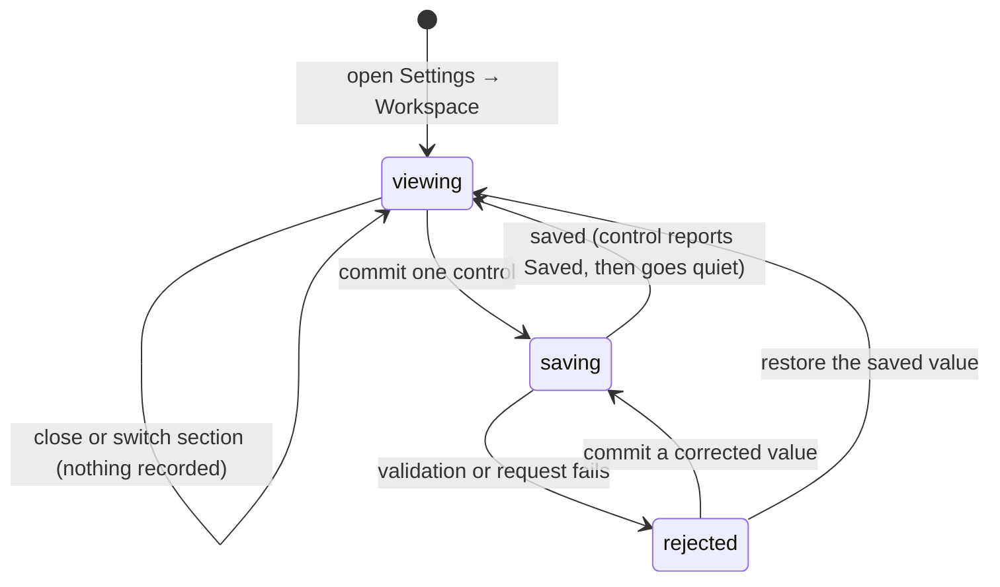

# Workspace settings

## Summary

Workspace settings is where the maintainer tells Patchdesk which GitHub identity, folders, and instruction files belong together. It is reached through Settings → Workspace and shows four cards in setup order: Reviewing as, Repositories, Advanced, and Workspace. Every control saves on its own and reports its own result beside itself. There is no Save button, no unsaved draft, and no question when Settings closes.

## The simple case

The maintainer opens Settings and chooses Workspace. Reviewing as states the GitHub account resolved from the GitHub CLI, or offers a selector when the CLI reports several accounts. Repositories lists the workspace's folders, each with Choose folder, the scan result beneath it, and a checkbox per discovered repository.

Changing a value saves it immediately: a text field commits when it loses focus or when Enter is pressed and its trimmed value differs from the saved one; the account selector, Choose folder, and a row's remove button commit as soon as they are used. The control says `Saving…`, then `Saved` for about two seconds. A folder is scanned as soon as it is saved, so the discovery status appears without any further action.

Advanced and Workspace are collapsed. Advanced holds rule paths. Workspace holds the workspace's Name, the Active workspace selector, and New workspace.

## The task, event by event

### Arrive

Settings opens on the requested section, or on General when no section was requested. Workspace shows Reviewing as, Repositories, Advanced, and Workspace, in that order. Every value comes from the active workspace as the server last confirmed it.

Reviewing as checks the GitHub CLI while the section is open. One authenticated account appears as a resolved statement; several appear in an Account selector. If the CLI is missing, unauthenticated, or cannot be checked, the card explains the failure and shows the manual GitHub account and GitHub host fields directly. Otherwise those fields sit behind Use a different account.

Repositories shows the folder rows under the legend `Folders`, each with Choose folder and a remove button, plus Add folder below them. Every saved folder shows its scan status and, when the scan found something, a checkbox per repository. Watched repositories whose local path is under no saved folder are grouped under `Watched outside these folders`.

Advanced and Workspace are closed. Advanced opens by itself when the workspace already has a rule path. Workspace opens by itself while a workspace switch started here is pending or has failed, because that status is reported inside it. Both stay closable afterwards.

The stored profile ID is not shown anywhere. The workspace's Name is the only name the maintainer sees or types.

### Leave unchanged

Reading the cards, opening or closing a disclosure, cancelling the folder picker, selecting the already active workspace, and closing Settings all record nothing. Closing Settings never asks a question, because nothing is held unsaved.

Committing a text field whose trimmed value equals the saved value writes nothing; the field simply normalizes to the trimmed text. Switching Settings sections unmounts the Workspace section, which is safe for the same reason.

### Begin an action

A text field — the manual GitHub account, the manual GitHub host, a folder row, a rule-path row, or the workspace Name — commits on blur and on Enter. The Account selector, Choose folder, and a row's remove button commit at once. Adding a row commits nothing until that row has a value: a blank row is local only, and a saved list never carries one.

Choosing a folder opens the native macOS folder picker and replaces that row's value with the returned absolute path.

New workspace opens the New workspace dialog. It asks for a Name and an Account, chosen from the accounts the GitHub CLI reports; when it reports none, it asks for a GitHub account and a GitHub host instead. Create workspace sends the creation request without an ID.

### While the action runs

The control that committed says `Saving…` beneath itself. Every other control stays usable. Patchdesk merges each change into the last body it sent, so two saves started close together compose instead of the second one undoing the first, and only the newest response is allowed to replace the displayed values.

The New workspace dialog shows `Creating workspace…` on its confirm button and disables Cancel and the close button while the request runs. Patchdesk derives the new workspace's ID from the name — lowercased, with every run of other characters replaced by `-`, and `-2`, `-3`, and so on appended if that ID is taken — then selects the new workspace and reloads.

### Settle

A successful save replaces the confirmed values, reloads the workspace, and leaves the control saying `Saved` for about two seconds before it goes quiet. Watched repositories are preserved: the save does not carry them. The first save from this tab also drops the retired owner-filters key from the stored file.

A rejected value stays on screen with the reason beneath the control. The previously saved value is kept, so the workspace is never left holding the rejection. Correcting the field and committing again retries; restoring the saved value clears the message.

A successful workspace creation selects the new workspace, closes the dialog, and reloads. The Repositories card then shows the new workspace with one blank folder row.

## Variants

| Variant                                                | Before the action runs                                                                                                                                       | While the action runs                                                                                                                          |
| ------------------------------------------------------ | ------------------------------------------------------------------------------------------------------------------------------------------------------------ | ------------------------------------------------------------------------------------------------------------------------------------------------ |
| Workspace profile and GitHub account                   | The active workspace supplies every displayed value. Reviewing as can replace the account with one the GitHub CLI reports.                                   | An account change saves like any other control. A new workspace becomes active only after its creation and selection both succeed.             |
| Pull request and Review state                          | No Review is required. Opening Settings preserves the underlying Pull requests screen or Review workbench.                                                    | Switching to another workspace clears the loaded workbench and returns the app to Pull requests once the switch is applied.                     |
| GitHub permissions and merge readiness                 | No repository permission or merge readiness is required, because saving is local. The configured account must still parse as a valid GitHub login.           | No GitHub write occurs. Reloading the workspace can later expose account or repository-read failures on the Pull requests screen.               |
| Network, local tool, and Insight provider availability | Network and Insight providers do not affect these controls. The GitHub CLI supplies Reviewing as and the New workspace dialog's account list.                 | The save itself uses local storage. A failed local API or storage request keeps the previously saved value and reports the failure.             |
| Input path: mouse, keyboard, or desktop menu           | Settings can open from app controls or the desktop menu. Fields, rows, disclosures, and selectors are keyboard operable.                                      | Commit on Enter and commit on blur reach the same save. A macOS folder picker temporarily owns focus.                                           |

Changing a variant during a save does not rewrite the request already in flight. A workspace switch takes ownership from any save still running for the workspace being left, so that save's answer cannot land on the workspace that arrives.

## Cancel and interrupt

| Event                                                                                                 | Before the action runs                                                                                                                            | While the action runs                                                                                                                                    |
| ----------------------------------------------------------------------------------------------------- | --------------------------------------------------------------------------------------------------------------------------------------------------- | ---------------------------------------------------------------------------------------------------------------------------------------------------------- |
| Cancel, Stop, or Escape                                                                               | Closing Settings records nothing and asks nothing. Cancel in the New workspace dialog discards its fields.                                          | A save has no Stop control. The New workspace dialog cannot be cancelled or closed while its request runs.                                                |
| Navigate to another Patchdesk screen, Review, Settings section, or workspace profile                  | Every navigation proceeds; there is no draft to guard. Selecting another workspace starts a switch.                                                 | A switch takes ownership, so a save in flight for the workspace being left is ignored when it answers. A section switch unmounts the cards.               |
| Start another action or request a refresh                                                             | Reviewing as Re-check and the repository checkboxes are separate actions with their own status.                                                     | Other controls stay usable during a save. Two saves compose; the newer response wins.                                                                     |
| GitHub, the network, a local tool, or an Insight provider fails or times out                          | A failed Reviewing as probe is reported in that card and changes no saved value. Network and Insight failures have no effect here.                  | A local API or storage failure leaves the previously saved value in place and reports the reason beside the control that caused it.                       |
| Close Settings, reload the renderer, close the window, or quit Patchdesk                              | Closing is unconditional. A clean close restores focus to the opener.                                                                               | A save in flight when Settings closes is not waited for; its result reaches storage or does not, and the next load is authoritative.                      |
| The pull request, represented revision, pending review, permission, or other target changes elsewhere | Pull-request and Review changes do not alter these values. Another workspace can be selected at any time.                                           | An older workspace-switch response is ignored when a newer target owns settlement. The cards adopt the server's workspace whenever no save is in flight.  |
| macOS focus, a file or folder picker, or another input path takes control                             | Cancelling Choose folder leaves its row unchanged. Selecting a folder returns its absolute path and saves it.                                       | Focus loss alone does not cancel the local request. Blur is itself a commit, so leaving a changed field saves it.                                         |

After an interrupt the maintainer stays in Settings with the values the server last confirmed. Nothing has to be discarded, because nothing was held back.

## Interactions with other systems

**Workspace profile and identity.** These cards own the editable workspace values. Reviewing as is a live probe beside the account control; the saved GitHub account is the identity later used for GitHub reads and writes.

**Review revision and freshness.** Editing does not depend on Review freshness. Applying a different workspace clears the loaded Review workbench, because Reviews are scoped by workspace.

**Local persistence and recovery.** The workspace and the selected-workspace choice are written locally. Watched repositories are preserved by a field save. Typed text that has not committed exists only in the mounted renderer.

**GitHub permissions and write authority.** Saving is not a GitHub write. It does not test repository permissions or authorize later Review writes.

**Network, local tools, and Insight providers.** The GitHub CLI supplies Reviewing as and the New workspace account list. Folder selection uses macOS. Insight-provider availability does not affect saving.

**Concurrent operations and locking.** Workspace-selection and global-settings config writes are serialized in the main process. The renderer applies only the newest save response and ignores an obsolete workspace-switch response.

**Feedback, errors, and diagnostics.** Each control reports `Saving…`, `Saved`, or its own failure message. There is no card-level save alert. A failed workspace selection records a retryable recovery diagnostic.

**Preferences, keyboard commands, and desktop integration.** Settings preserves the underlying destination and returns focus to the opener on close. The native folder picker supplies folder paths.

**Supported input and accessibility limits.** These cards support keyboard and mouse use. Patchdesk does not claim screen-reader, touch, or pen support.

## Edge cases

- Removing the last row of a list saves an empty list. A blank row saves nothing at all and is not persisted.
- A text field is trimmed when it commits; the text stays as typed while editing.
- One authenticated GitHub account is adopted into a workspace with no account. With several accounts, only the account `gh` marks active is adopted, and only once.
- A configured account that matches no account `gh` reports stays saved and raises the `Configured account not authenticated` warning instead of being replaced.
- Manual GitHub account and host fields stay visible whenever the probe is checking or failed, and whenever either field's own value was rejected.
- A 39-character GitHub login is valid. A longer login, or one with invalid characters, is rejected and reported beside the field.
- A folder is scanned as soon as it is saved; there is no state in which a folder waits for a separate save.
- New workspace derives its ID from the name, so two workspaces named the same get `-2`, `-3`, and so on. A blank Name is rejected with `Name cannot be blank.` before any request.
- A failed workspace switch keeps the previous workspace active and leaves every value as saved.
- Two rapid workspace selections can settle out of order. Only the latest requested target is applied.
- A workspace with no folder keeps one blank folder row, so Choose folder is always present.

## Open questions and verification

- Live desktop verification of the reworked cards is pending; the checklists in `verification/` still describe the previous editor.
- Confirm focus after the folder picker returns and after a rejected value is reported.
- Confirm what the maintainer sees when a save is still in flight as Settings closes.
- Confirm that a workspace created from the dialog appears in the Active workspace selector without a reload.

Baseline drafted from Patchdesk application source commit `3100615`; workspace settings rework described from `883fad2`.
